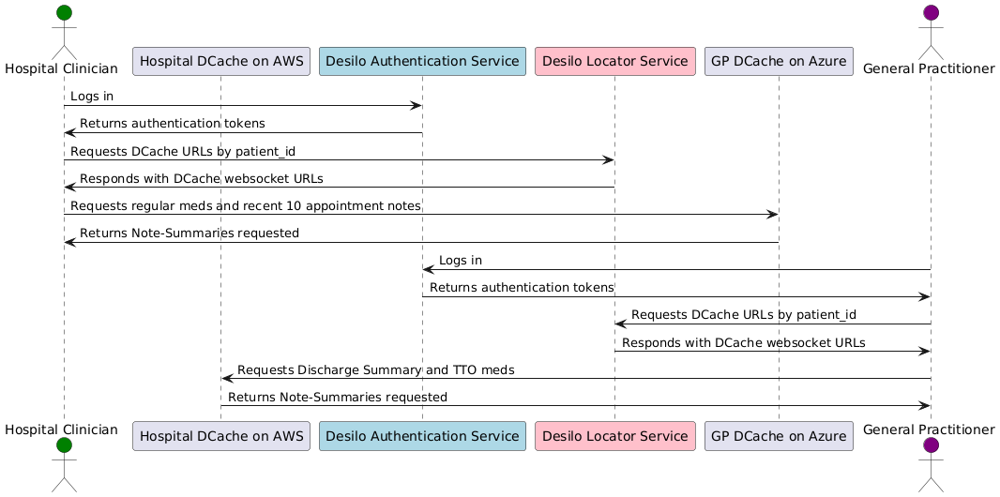

# Desilo - A Secure Protocol for Fetching Siloed Patient Notes

As a junior doctor, I often faced the critical task of treating elderly patients who couldn't provide a reliable medical history in the middle of the night. With no family to call, no local records, and a closed GP surgery, the risk of missing life-saving medication was high. This struggle to piece together scattered and fragmented patient information is a challenge faced by clinicians worldwide. Desilo aims to solve this by securely fetching and sharing essential patient notes between hospital sites, providing a vital picture for healthcare providers.

Desilo is a simple and open protocol designed to securely fetch siloed patient notes in HL7 FHIR format between hospital sites using interoperability standards. It leverages encrypted websocket connections and cryptographic signatures to ensure data security and integrity, and is built to be resilient without relying on a monolithic national patient database which can be compromised, leading to the catastrophic data breaches we often see in the news, even from reputable companies.

The Desilo Protocol is inspired by the Nostr Protocol, but has been modified in order to meet the the data security and regulatory requirements of healthcare.

### Desilo Authentication Service

Due to the importance of robust authentication in healthcare, so only accredited healthcare providers can access patient data, a central Authentication Service is used, with issues JSON Web Tokens to allow both access and granular authentication grants so clinicians can have carefully scoped access.

### Desilo Locator Service

This is a simple lookup service which returns, for a given patient ID string, the websocket urls of DCache servers across the country which hold data about them.

### Desilo DCaches

The DCaches are where all the patient data snippets, or Note-Summaries, are stored for later retrieval by an authorised clinician. 

DCaches are extremely simple, small and easy to set up servers which do two things. The first is that they store data in a database, namely FHIR snippets mapped to a patient identifier, with metadata tags and Kinds for easy filtering. The second is to expose an API which accepts a request with filter parameters. When queried, they verify the access token and send the data. When Note-Summaries are posted to them, they verify the access token and write the data to the database. That's all.

## How it works

The concept is straightforward: each hospital site can publish vital patient Note-Summaries, like appointment notes, investigation results, regular medications and allergies, past medical history, or any other health data in FHIR format, to their own, or another care provider's DCache that can be instantly deployed with very little setup, cost, complexity, tailoring, or overhead. These servers simply perform two functions: store messages and accept authenticated requests. They can only be updated by authorised care providers or patients. Healthcare providers at different sites can connect to and make requests (containing filter parameters) from these DCaches to securely fetch the required patient notes. The protocol defines the messages exchanged between clients and DCaches to publish and fetch patient notes securely.

DCaches can be hosted on-site, delegated to cloud providers like Azure or AWS controlled by the care setting, or outsourced to a third-party supplier. Each care setting can also publish Note-Summaries to the DCaches run by other care providers, depending on the rules set by the provider, if they are perhaps smaller and don't have the technical know-how. The intention is to create a secure, low-risk, cost-effective, access-controlled layer for the sharing of vital patient data.

The two central components of the Desilo network are the Authorisation Service, which is a secure registry of care provider identities and authorisation levels, and the Locator Service, which tracks Note-Summaries by ID (a 32-bit unique hex string), maps each ID to a DCache.

Public-key cryptography is used to sign each patient Note-Summary, which adds a digital signature of the authorized individual and care setting, ensuring the integrity and authenticity of the patient notes. When a healthcare provider requests Note-Summaries, they must also provide a JWT access token to both authenticate to the DCache and prove they have the correct authority to access Note-Summaries for a given patient.

## Protocol specification

For detailed information about the protocol, you can refer to the Desilo Improvements [DIPs] which outline the technical details and message formats used in Desilo. To contribute, simply raise a merge/pull request with your proposed DIP.

## Getting started

Our goal is for Desilo to be the product of many minds across disciplines and will evolve as various contributors submit DIPs and the Desilo Protocol Specification set develops.

## Licence

Desilo is licenced under the MIT Licence.
